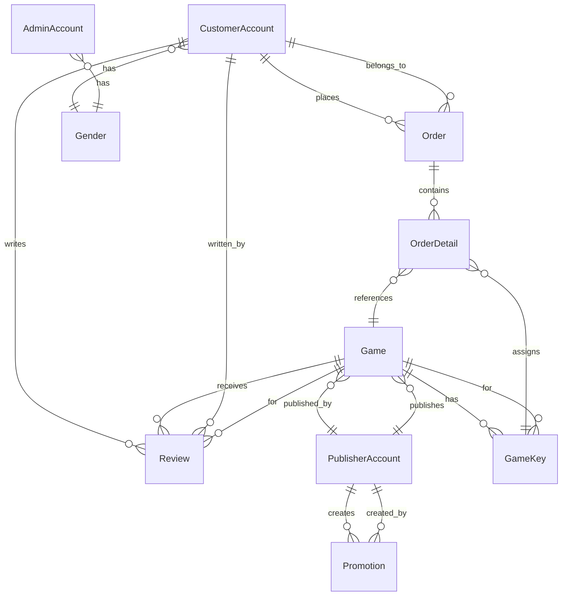
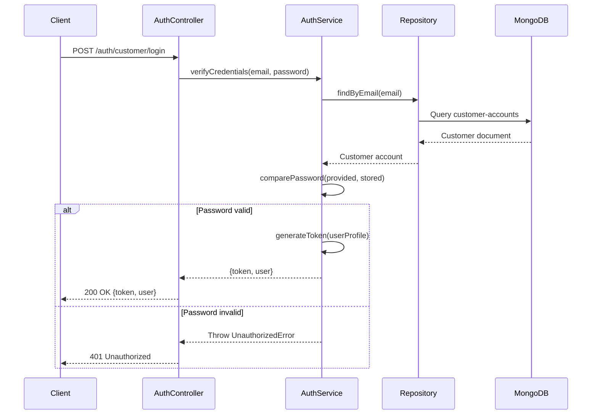

# Design Document

## Overview

This design document outlines the architecture and implementation approach for migrating the Game Store backend from C# WPF with SQL Server to a modern TypeScript REST API using LoopBack 4 framework with MongoDB. The new system will provide a scalable, maintainable API that supports the existing desktop client and enables future web and mobile applications.

### Technology Stack

- **Framework**: LoopBack 4 (Node.js/TypeScript)
- **Database**: MongoDB 5.0+
- **Authentication**: JWT (JSON Web Tokens)
- **Password Hashing**: bcrypt
- **API Documentation**: OpenAPI 3.0 (auto-generated)
- **Validation**: @loopback/rest-validation
- **Runtime**: Node.js 18+ LTS

### Design Principles

1. **RESTful API Design**: Follow REST conventions for resource naming and HTTP methods
2. **Separation of Concerns**: Clear separation between models, repositories, controllers, and services
3. **Security First**: JWT authentication, password hashing, input validation, and authorization checks
4. **Data Integrity**: Proper relationships and constraints at application and database level
5. **Scalability**: Stateless API design supporting horizontal scaling
6. **Maintainability**: Clean code, TypeScript type safety, and comprehensive documentation

## Architecture

### High-Level Architecture

```
┌─────────────────────────────────────────────────────────────┐
│                        API Clients                          │
│         (WPF Desktop, Future Web/Mobile Apps)               │
└────────────────────────┬────────────────────────────────────┘
                         │ HTTPS/REST
                         ▼
┌─────────────────────────────────────────────────────────────┐
│                   LoopBack 4 Application                    │
│  ┌──────────────────────────────────────────────────────┐  │
│  │              Controllers Layer                       │  │
│  │  (Auth, Customer, Publisher, Admin, Game, Order)    │  │
│  └────────────┬─────────────────────────────────────────┘  │
│               │                                             │
│  ┌────────────▼─────────────────────────────────────────┐  │
│  │           Services Layer                             │  │
│  │  (Authentication, Password Hashing, Business Logic)  │  │
│  └────────────┬─────────────────────────────────────────┘  │
│               │                                             │
│  ┌────────────▼─────────────────────────────────────────┐  │
│  │          Repositories Layer                          │  │
│  │  (Data Access, Relationship Management)              │  │
│  └────────────┬─────────────────────────────────────────┘  │
│               │                                             │
│  ┌────────────▼─────────────────────────────────────────┐  │
│  │            Models Layer                              │  │
│  │  (Entity Definitions, Validation Rules)              │  │
│  └──────────────────────────────────────────────────────┘  │
└────────────────────────┬────────────────────────────────────┘
                         │ MongoDB Driver
                         ▼
┌─────────────────────────────────────────────────────────────┐
│                      MongoDB Database                       │
│  Collections: customer-accounts, games, orders, etc.       │
└─────────────────────────────────────────────────────────────┘
```

### Project Structure

```
game-store-api/
├── src/
│   ├── models/              # Entity models
│   │   ├── customer-account.model.ts
│   │   ├── publisher-account.model.ts
│   │   ├── admin-account.model.ts
│   │   ├── game.model.ts
│   │   ├── game-key.model.ts
│   │   ├── order.model.ts
│   │   ├── order-detail.model.ts
│   │   ├── review.model.ts
│   │   ├── promotion.model.ts
│   │   ├── gender.model.ts
│   │   └── index.ts
│   ├── repositories/        # Data access layer
│   │   ├── customer-account.repository.ts
│   │   ├── publisher-account.repository.ts
│   │   ├── admin-account.repository.ts
│   │   ├── game.repository.ts
│   │   ├── game-key.repository.ts
│   │   ├── order.repository.ts
│   │   ├── order-detail.repository.ts
│   │   ├── review.repository.ts
│   │   ├── promotion.repository.ts
│   │   ├── gender.repository.ts
│   │   └── index.ts
│   ├── controllers/         # API endpoints
│   │   ├── auth.controller.ts
│   │   ├── customer-account.controller.ts
│   │   ├── publisher-account.controller.ts
│   │   ├── admin-account.controller.ts
│   │   ├── game.controller.ts
│   │   ├── game-key.controller.ts
│   │   ├── order.controller.ts
│   │   ├── review.controller.ts
│   │   ├── promotion.controller.ts
│   │   └── index.ts
│   ├── services/            # Business logic
│   │   ├── auth.service.ts
│   │   ├── password.service.ts
│   │   ├── order.service.ts
│   │   └── index.ts
│   ├── datasources/         # Database connections
│   │   ├── mongodb.datasource.ts
│   │   └── index.ts
│   ├── interceptors/        # Request/response interceptors
│   │   └── auth.interceptor.ts
│   ├── types/               # TypeScript type definitions
│   │   ├── auth.types.ts
│   │   └── index.ts
│   ├── application.ts       # Application configuration
│   ├── index.ts             # Entry point
│   └── migrate.ts           # Database migration script
├── .env                     # Environment variables
├── .env.example             # Environment template
├── package.json
├── tsconfig.json
└── README.md
```

## Components and Interfaces

### 1. Data Models

#### CustomerAccount Model

**Purpose**: Represents customer user accounts

**Properties**:
- `id`: string (MongoDB ObjectId, auto-generated)
- `email`: string (unique, indexed, email format)
- `phoneNumber`: string (unique, indexed, Vietnamese phone format)
- `username`: string (3-50 characters)
- `password`: string (bcrypt hashed, hidden from responses)
- `genderId`: string (optional, reference to Gender)
- `registrationDate`: Date (auto-set on creation)
- `accountStatus`: string (enum: Active, Inactive, Suspended)
- `accountBalance`: number (default: 0)
- `bankType`: string (optional)
- `bankName`: string (optional)
- `description`: string (optional)
- `createdAt`: Date (auto-managed)
- `updatedAt`: Date (auto-managed)

**Relationships**:
- belongsTo Gender
- hasMany Order
- hasMany Review

**Indexes**:
- Unique index on email
- Unique index on phoneNumber

#### PublisherAccount Model

**Purpose**: Represents game publisher accounts

**Properties**:
- `id`: string (MongoDB ObjectId)
- `publisherName`: string (required)
- `email`: string (unique, indexed)
- `phoneNumber`: string (required)
- `socialMedia`: string (optional)
- `bankType`: string (optional)
- `bankName`: string (optional)
- `contractDate`: Date (required)
- `contractDuration`: number (months, required)
- `activityStatus`: string (enum: Active, Inactive)
- `password`: string (bcrypt hashed, hidden)
- `createdAt`: Date
- `updatedAt`: Date

**Relationships**:
- hasMany Game
- hasMany Promotion

**Indexes**:
- Unique index on email

#### AdminAccount Model

**Purpose**: Represents system administrator accounts

**Properties**:
- `id`: string (MongoDB ObjectId)
- `email`: string (unique, indexed)
- `genderId`: string (optional, reference to Gender)
- `phoneNumber`: string (required)
- `role`: string (enum: SuperAdmin, Admin, Moderator)
- `password`: string (bcrypt hashed, hidden)
- `createdAt`: Date
- `updatedAt`: Date

**Relationships**:
- belongsTo Gender

**Indexes**:
- Unique index on email

#### Game Model

**Purpose**: Represents game products available for purchase

**Properties**:
- `id`: string (MongoDB ObjectId)
- `name`: string (required)
- `genre`: string (required)
- `description`: string (required)
- `imageUrl`: string (optional, URL to image storage)
- `videoUrl`: string (optional, URL to video)
- `releaseDate`: Date (required)
- `publisherId`: string (required, reference to PublisherAccount)
- `releaseStatus`: string (enum: Released, Upcoming, Delisted, default: Released)
- `version`: string (required)
- `originalPrice`: number (required, minimum: 0)
- `discountPrice`: number (optional, minimum: 0)
- `createdAt`: Date
- `updatedAt`: Date

**Relationships**:
- belongsTo PublisherAccount
- hasMany GameKey
- hasMany Review

**Indexes**:
- Index on publisherId
- Index on releaseStatus
- Text index on name for search

#### GameKey Model

**Purpose**: Represents unique activation keys for game purchases

**Properties**:
- `id`: string (MongoDB ObjectId)
- `gameId`: string (required, reference to Game)
- `gameVersion`: string (required)
- `ownedByCustomerId`: string (optional, reference to CustomerAccount)
- `publishRegistrationDate`: Date (required, auto-set on creation)
- `customerOwnershipDate`: Date (optional, set when purchased)
- `businessStatus`: string (enum: Available, Sold, Reserved, default: Available)
- `activationStatus`: string (enum: Activated, NotActivated, default: NotActivated)
- `createdAt`: Date
- `updatedAt`: Date

**Relationships**:
- belongsTo Game
- belongsTo CustomerAccount (optional, when owned)

**Indexes**:
- Index on gameId
- Index on businessStatus
- Compound index on (gameId, businessStatus) for efficient key availability queries

#### Order Model

**Purpose**: Represents customer purchase transactions

**Properties**:
- `id`: string (MongoDB ObjectId)
- `customerId`: string (required, reference to CustomerAccount)
- `orderDate`: Date (required, auto-set on creation)
- `totalValue`: number (required, minimum: 0)
- `paymentMethod`: string (enum: Wallet, CreditCard, PayPal)
- `transactionId`: string (required, unique)
- `paymentStatus`: string (enum: Pending, Completed, Failed, Refunded, default: Pending)
- `createdAt`: Date
- `updatedAt`: Date

**Relationships**:
- belongsTo CustomerAccount
- hasMany OrderDetail

**Indexes**:
- Index on customerId
- Index on paymentStatus
- Unique index on transactionId

#### OrderDetail Model

**Purpose**: Represents line items within an order

**Properties**:
- `id`: string (MongoDB ObjectId)
- `orderId`: string (required, reference to Order)
- `gameId`: string (required, reference to Game)
- `gameKeyId`: string (required, reference to GameKey)
- `value`: number (required, price at time of purchase)
- `createdAt`: Date
- `updatedAt`: Date

**Relationships**:
- belongsTo Order
- belongsTo Game
- belongsTo GameKey

**Indexes**:
- Index on orderId
- Index on gameKeyId

#### Review Model

**Purpose**: Represents customer reviews and ratings for games

**Properties**:
- `id`: string (MongoDB ObjectId)
- `customerId`: string (required, reference to CustomerAccount)
- `gameId`: string (required, reference to Game)
- `reviewText`: string (required)
- `rating`: number (required, 1-5)
- `createdAt`: Date
- `updatedAt`: Date

**Relationships**:
- belongsTo CustomerAccount
- belongsTo Game

**Indexes**:
- Compound unique index on (customerId, gameId) to prevent duplicate reviews
- Index on gameId for efficient review queries

#### Promotion Model

**Purpose**: Represents promotional offers and discounts

**Properties**:
- `id`: string (MongoDB ObjectId)
- `promotionName`: string (required)
- `discountType`: string (enum: Percentage, FixedAmount)
- `applicableScope`: string (enum: AllGames, SpecificGames, Category)
- `applicationCondition`: string (required)
- `startDate`: Date (required)
- `expirationDate`: Date (required)
- `endDate`: Date (required)
- `quantityIssued`: number (required, minimum: 0)
- `status`: string (enum: Active, Inactive, Expired)
- `publisherId`: string (required, reference to PublisherAccount)
- `createdAt`: Date
- `updatedAt`: Date

**Relationships**:
- belongsTo PublisherAccount

**Indexes**:
- Index on publisherId
- Index on status
- Index on startDate and expirationDate for active promotion queries

#### Gender Model

**Purpose**: Reference data for gender options

**Properties**:
- `id`: string (MongoDB ObjectId)
- `name`: string (required, e.g., "Male", "Female", "Other")

**Relationships**:
- hasMany CustomerAccount
- hasMany AdminAccount

### 2. Repositories

All repositories extend `DefaultCrudRepository` and are configured with the MongoDB datasource.

#### Key Repository Methods

**CustomerAccountRepository**:
- `findByEmail(email: string)`: Find account by email
- `findByPhoneNumber(phone: string)`: Find account by phone number
- `findByCredentials(username: string)`: Find by email or phone number

**GameRepository**:
- `findByPublisher(publisherId: string)`: Get games by publisher
- `findByGenre(genre: string)`: Get games by genre
- `searchByName(name: string)`: Search games by name (case-insensitive)
- `findAvailableGames()`: Get games with Released status

**GameKeyRepository**:
- `findAvailableKeys(gameId: string)`: Get available keys for a game
- `assignKeyToCustomer(keyId: string, customerId: string)`: Assign key to customer
- `countAvailableKeys(gameId: string)`: Count available keys

**OrderRepository**:
- `findByCustomer(customerId: string)`: Get customer orders
- `findPendingOrders()`: Get orders with Pending status

**ReviewRepository**:
- `findByGame(gameId: string)`: Get reviews for a game
- `findByCustomer(customerId: string)`: Get customer reviews
- `calculateAverageRating(gameId: string)`: Calculate average rating

### 3. Services

#### AuthService

**Purpose**: Handle authentication logic

**Methods**:
- `hashPassword(password: string): Promise<string>`: Hash password with bcrypt
- `comparePassword(provided: string, stored: string): Promise<boolean>`: Verify password
- `verifyCustomerCredentials(email: string, password: string): Promise<UserProfile>`: Verify customer login
- `verifyPublisherCredentials(email: string, password: string): Promise<UserProfile>`: Verify publisher login
- `verifyAdminCredentials(email: string, password: string): Promise<UserProfile>`: Verify admin login
- `generateToken(userProfile: UserProfile): string`: Generate JWT token

#### OrderService

**Purpose**: Handle order creation and payment logic

**Methods**:
- `createOrder(customerId: string, gameIds: string[]): Promise<Order>`: Create new order
- `processPayment(orderId: string, paymentMethod: string): Promise<Order>`: Process payment
- `processWalletPayment(orderId: string, customerId: string): Promise<Order>`: Pay with account balance
- `refundOrder(orderId: string): Promise<Order>`: Process refund
- `assignGameKeys(orderId: string, gameIds: string[]): Promise<void>`: Assign keys to order

### 4. Controllers and API Endpoints

#### AuthController

**Base Path**: `/auth`

**Endpoints**:
- `POST /auth/customer/register`: Register new customer account
  - Request: `{email, phoneNumber, username, password, genderId?}`
  - Response: `201 Created` with customer account (excluding password)
  
- `POST /auth/customer/login`: Customer login
  - Request: `{email, password}`
  - Response: `200 OK` with `{token, user}`
  
- `POST /auth/publisher/register`: Register new publisher account
  - Request: `{publisherName, email, phoneNumber, password, contractDate, contractDuration, ...}`
  - Response: `201 Created` with publisher account
  
- `POST /auth/publisher/login`: Publisher login
  - Request: `{email, password}`
  - Response: `200 OK` with `{token, user}`
  
- `POST /auth/admin/login`: Admin login
  - Request: `{email, password}`
  - Response: `200 OK` with `{token, user}`

#### CustomerAccountController

**Base Path**: `/customers`

**Endpoints**:
- `GET /customers/me`: Get current customer profile (authenticated)
  - Response: `200 OK` with customer account
  
- `PATCH /customers/me`: Update current customer profile (authenticated)
  - Request: `{username?, phoneNumber?, bankType?, bankName?, description?}`
  - Response: `200 OK` with updated account
  
- `POST /customers/me/change-password`: Change password (authenticated)
  - Request: `{currentPassword, newPassword}`
  - Response: `204 No Content`
  
- `GET /customers/me/orders`: Get customer order history (authenticated)
  - Query: `?page=1&limit=10`
  - Response: `200 OK` with paginated orders

#### PublisherAccountController

**Base Path**: `/publishers`

**Endpoints**:
- `GET /publishers/me`: Get current publisher profile (authenticated)
  - Response: `200 OK` with publisher account
  
- `PATCH /publishers/me`: Update publisher profile (authenticated)
  - Request: `{publisherName?, phoneNumber?, socialMedia?, ...}`
  - Response: `200 OK` with updated account
  
- `GET /publishers/me/games`: Get publisher's games (authenticated)
  - Response: `200 OK` with game list

#### GameController

**Base Path**: `/games`

**Endpoints**:
- `GET /games`: Get all available games (public)
  - Query: `?page=1&limit=20&genre=Action&search=minecraft&publisherId=xxx`
  - Response: `200 OK` with paginated games
  
- `GET /games/{id}`: Get game details (public)
  - Response: `200 OK` with game details including publisher and average rating
  
- `POST /games`: Create new game (authenticated publisher)
  - Request: `{name, genre, description, releaseDate, version, originalPrice, ...}`
  - Response: `201 Created` with game
  
- `PATCH /games/{id}`: Update game (authenticated publisher, owner only)
  - Request: `{name?, genre?, description?, originalPrice?, discountPrice?, ...}`
  - Response: `200 OK` with updated game
  
- `DELETE /games/{id}`: Delist game (authenticated publisher, owner only)
  - Response: `204 No Content`
  
- `GET /games/{id}/reviews`: Get game reviews (public)
  - Query: `?page=1&limit=10&sort=date_desc`
  - Response: `200 OK` with paginated reviews and average rating

#### GameKeyController

**Base Path**: `/game-keys`

**Endpoints**:
- `POST /game-keys`: Create game keys (authenticated publisher)
  - Request: `{gameId, gameVersion, quantity}`
  - Response: `201 Created` with created keys count
  
- `GET /game-keys`: Get publisher's game keys (authenticated publisher)
  - Query: `?gameId=xxx&status=Available`
  - Response: `200 OK` with game keys
  
- `GET /game-keys/available/{gameId}`: Get available key count for game (public)
  - Response: `200 OK` with `{count: number}`

#### OrderController

**Base Path**: `/orders`

**Endpoints**:
- `POST /orders`: Create new order (authenticated customer)
  - Request: `{gameIds: string[], paymentMethod: string}`
  - Response: `201 Created` with order details
  
- `GET /orders/{id}`: Get order details (authenticated, owner or admin)
  - Response: `200 OK` with order including order details and game keys
  
- `POST /orders/{id}/pay`: Process payment (authenticated customer, owner only)
  - Request: `{paymentMethod: 'Wallet' | 'CreditCard' | 'PayPal'}`
  - Response: `200 OK` with updated order
  
- `GET /orders`: Get all orders (authenticated admin only)
  - Query: `?page=1&limit=20&status=Pending&customerId=xxx`
  - Response: `200 OK` with paginated orders

#### ReviewController

**Base Path**: `/reviews`

**Endpoints**:
- `POST /reviews`: Create or update review (authenticated customer)
  - Request: `{gameId, reviewText, rating}`
  - Response: `200 OK` with review
  
- `GET /reviews/my-reviews`: Get customer's reviews (authenticated customer)
  - Response: `200 OK` with reviews
  
- `DELETE /reviews/{id}`: Delete review (authenticated customer, owner only)
  - Response: `204 No Content`

#### PromotionController

**Base Path**: `/promotions`

**Endpoints**:
- `POST /promotions`: Create promotion (authenticated publisher)
  - Request: `{promotionName, discountType, startDate, expirationDate, ...}`
  - Response: `201 Created` with promotion
  
- `GET /promotions`: Get active promotions (public)
  - Query: `?publisherId=xxx`
  - Response: `200 OK` with promotions
  
- `GET /promotions/my-promotions`: Get publisher's promotions (authenticated publisher)
  - Response: `200 OK` with promotions
  
- `PATCH /promotions/{id}`: Update promotion (authenticated publisher, owner only)
  - Request: `{promotionName?, status?, ...}`
  - Response: `200 OK` with updated promotion

#### AdminAccountController

**Base Path**: `/admin`

**Endpoints**:
- `GET /admin/customers`: Get all customer accounts (authenticated admin)
  - Query: `?page=1&limit=20&status=Active`
  - Response: `200 OK` with paginated customers
  
- `PATCH /admin/customers/{id}`: Update customer account (authenticated admin)
  - Request: `{accountStatus?, accountBalance?, ...}`
  - Response: `200 OK` with updated account
  
- `GET /admin/publishers`: Get all publisher accounts (authenticated admin)
  - Response: `200 OK` with publishers
  
- `GET /admin/games`: Get all games including delisted (authenticated admin)
  - Response: `200 OK` with games
  
- `POST /admin/orders/{id}/refund`: Refund order (authenticated admin)
  - Response: `200 OK` with refunded order

## Data Models

### Entity Relationship Diagram



### MongoDB Collections Schema

#### customer-accounts
```json
{
  "_id": ObjectId,
  "email": String (unique),
  "phoneNumber": String (unique),
  "username": String,
  "password": String (hashed),
  "genderId": String,
  "registrationDate": Date,
  "accountStatus": String,
  "accountBalance": Number,
  "bankType": String,
  "bankName": String,
  "description": String,
  "createdAt": Date,
  "updatedAt": Date
}
```

#### games
```json
{
  "_id": ObjectId,
  "name": String,
  "genre": String,
  "description": String,
  "imageUrl": String,
  "videoUrl": String,
  "releaseDate": Date,
  "publisherId": String,
  "releaseStatus": String,
  "version": String,
  "originalPrice": Number,
  "discountPrice": Number,
  "createdAt": Date,
  "updatedAt": Date
}
```

#### orders
```json
{
  "_id": ObjectId,
  "customerId": String,
  "orderDate": Date,
  "totalValue": Number,
  "paymentMethod": String,
  "transactionId": String (unique),
  "paymentStatus": String,
  "createdAt": Date,
  "updatedAt": Date
}
```

## Error Handling

### Error Response Format

All errors follow a consistent format:

```json
{
  "error": {
    "statusCode": 400,
    "name": "BadRequestError",
    "message": "Validation failed",
    "details": [
      {
        "path": "email",
        "code": "format",
        "message": "must be a valid email"
      }
    ]
  }
}
```

### HTTP Status Codes

- `200 OK`: Successful GET, PATCH requests
- `201 Created`: Successful POST requests creating resources
- `204 No Content`: Successful DELETE requests or operations with no response body
- `400 Bad Request`: Validation errors, invalid input
- `401 Unauthorized`: Authentication required or failed
- `403 Forbidden`: Authenticated but not authorized for resource
- `404 Not Found`: Resource not found
- `409 Conflict`: Unique constraint violation (duplicate email, phone)
- `500 Internal Server Error`: Unexpected server errors

### Error Handling Strategy

1. **Validation Errors**: Use LoopBack's built-in validation with JSON Schema
2. **Authentication Errors**: JWT middleware handles token validation
3. **Authorization Errors**: Custom interceptors check resource ownership
4. **Database Errors**: Catch MongoDB errors and translate to appropriate HTTP status
5. **Business Logic Errors**: Throw HttpErrors with appropriate status codes
6. **Logging**: Log all errors with context for debugging

## Authentication & Authorization

### JWT Token Structure

```json
{
  "sub": "customer_id_or_publisher_id_or_admin_id",
  "email": "user@example.com",
  "username": "username",
  "accountType": "customer" | "publisher" | "admin",
  "iat": 1234567890,
  "exp": 1234567890
}
```

### Authentication Flow



### Authorization Strategy

1. **Public Endpoints**: No authentication required (game browsing, reviews viewing)
2. **Customer Endpoints**: Require customer JWT token
3. **Publisher Endpoints**: Require publisher JWT token
4. **Admin Endpoints**: Require admin JWT token
5. **Resource Ownership**: Additional checks for operations on owned resources

### Password Security

- **Hashing Algorithm**: bcrypt with 10 salt rounds
- **Password Requirements**: Minimum 8 characters (enforced at validation layer)
- **Storage**: Never store plain text passwords
- **Transmission**: Always use HTTPS in production
- **Response Filtering**: Password field marked as `hidden` in model, never returned in API responses

## Testing Strategy

### Unit Tests

**Models**:
- Validation rules (email format, phone format, required fields)
- Default values (accountStatus, accountBalance, registrationDate)
- Relationship definitions

**Repositories**:
- CRUD operations
- Custom query methods (findByEmail, findAvailableKeys)
- Relationship accessors

**Services**:
- Password hashing and comparison
- Credential verification
- Token generation
- Order creation logic
- Payment processing logic

**Controllers**:
- Request validation
- Response formatting
- Error handling
- Authorization checks

### Integration Tests

**Authentication Flow**:
- Customer registration and login
- Publisher registration and login
- Admin login
- Token validation
- Password change

**Game Management**:
- Publisher creates game
- Customer browses games
- Search and filter functionality
- Game key generation

**Order Flow**:
- Customer creates order
- Game keys assigned
- Payment processing
- Order history retrieval

**Review System**:
- Customer submits review
- Duplicate review prevention
- Average rating calculation

### Test Data Setup

- Seed database with test data (genders, sample accounts)
- Use separate test database
- Clean up after each test suite
- Mock external services if any

### Testing Tools

- **Framework**: Mocha (included with LoopBack 4)
- **Assertions**: Chai
- **HTTP Testing**: Supertest
- **Coverage**: nyc (Istanbul)

## Migration Strategy

### Data Migration from SQL Server to MongoDB

#### Phase 1: Schema Mapping

1. **Analyze SQL Server schema**: Review Entity Framework models and database schema
2. **Map relationships**: Convert foreign keys to MongoDB references
3. **Handle binary data**: Convert image BLOBs to file storage with URLs
4. **Translate names**: Apply Vietnamese to English naming convention

#### Phase 2: Data Export

1. **Export SQL Server data**: Use SQL queries or Entity Framework to export data to JSON
2. **Transform data structure**: Convert to MongoDB document format
3. **Handle special cases**:
   - Convert SQL Server datetime to ISO date strings
   - Hash existing passwords with bcrypt (if not already hashed)
   - Generate MongoDB ObjectIds for existing records
   - Convert composite keys to single ObjectId with references

#### Phase 3: Data Import

1. **Create MongoDB collections**: Use LoopBack models to define schema
2. **Import transformed data**: Use MongoDB import tools or custom scripts
3. **Create indexes**: Apply indexes defined in models
4. **Verify data integrity**: Check relationships and constraints

#### Phase 4: Validation

1. **Count verification**: Ensure record counts match
2. **Relationship verification**: Verify all references are valid
3. **Sample data checks**: Manually verify sample records
4. **Test queries**: Run common queries to ensure data accessibility

### Migration Script Structure

```typescript
// src/migrate.ts
import {GameStoreApplication} from './application';
import {CustomerAccountRepository, GameRepository, OrderRepository} from './repositories';
import * as fs from 'fs';

async function migrate() {
  const app = new GameStoreApplication();
  await app.boot();
  
  // Import customers
  const customerRepo = await app.getRepository(CustomerAccountRepository);
  const customersData = JSON.parse(fs.readFileSync('data/customers.json', 'utf8'));
  for (const customer of customersData) {
    await customerRepo.create(customer);
  }
  
  // Import games
  // Import orders
  // etc.
  
  console.log('Migration completed');
}

migrate().catch(err => {
  console.error('Migration failed:', err);
  process.exit(1);
});
```

## Deployment Considerations

### Environment Configuration

**Development**:
```env
NODE_ENV=development
PORT=3000
MONGODB_URL=mongodb://localhost:27017/game-store-dev
JWT_SECRET=dev-secret-change-in-production
JWT_EXPIRES_IN=7d
BCRYPT_ROUNDS=10
LOG_LEVEL=debug
```

**Production**:
```env
NODE_ENV=production
PORT=3000
MONGODB_URL=mongodb://mongo-server:27017/game-store-prod
JWT_SECRET=<strong-random-secret>
JWT_EXPIRES_IN=7d
BCRYPT_ROUNDS=12
LOG_LEVEL=info
```

### MongoDB Configuration

- **Connection Pooling**: Configure appropriate pool size for load
- **Indexes**: Ensure all indexes are created before production
- **Backup Strategy**: Regular automated backups
- **Replica Set**: Use replica set for high availability
- **Authentication**: Enable MongoDB authentication in production

### Application Deployment

1. **Build**: Compile TypeScript to JavaScript (`npm run build`)
2. **Dependencies**: Install production dependencies only
3. **Process Manager**: Use PM2 or similar for process management
4. **Reverse Proxy**: Use Nginx or similar for SSL termination
5. **Monitoring**: Set up application and database monitoring
6. **Logging**: Configure centralized logging (e.g., Winston, ELK stack)

### Security Checklist

- [ ] HTTPS enabled in production
- [ ] Strong JWT secret configured
- [ ] MongoDB authentication enabled
- [ ] Rate limiting configured
- [ ] CORS properly configured
- [ ] Input validation on all endpoints
- [ ] SQL injection prevention (N/A for MongoDB, but validate input)
- [ ] Password hashing with bcrypt
- [ ] Sensitive data not logged
- [ ] Error messages don't expose system details

## Performance Optimization

### Database Optimization

1. **Indexes**: Create indexes on frequently queried fields
   - email, phoneNumber (unique indexes)
   - gameId, customerId, publisherId (foreign key indexes)
   - releaseStatus, paymentStatus (filter indexes)
   - name (text index for search)

2. **Query Optimization**:
   - Use projection to limit returned fields
   - Implement pagination for large result sets
   - Use aggregation pipeline for complex queries

3. **Connection Pooling**: Configure MongoDB connection pool size

### Application Optimization

1. **Caching**: Implement caching for frequently accessed data (e.g., game list, active promotions)
2. **Pagination**: Always paginate list endpoints
3. **Lazy Loading**: Load relationships only when needed
4. **Response Compression**: Enable gzip compression
5. **Static Assets**: Serve images/videos from CDN

### Monitoring Metrics

- API response times
- Database query performance
- Error rates
- Authentication success/failure rates
- Active user sessions
- Order completion rates
- Database connection pool usage

## API Documentation

### OpenAPI Specification

LoopBack 4 automatically generates OpenAPI 3.0 specification from controller decorators.

**Access**: `http://localhost:3000/openapi.json`

**Explorer**: `http://localhost:3000/explorer`

### Documentation Best Practices

1. **Endpoint Descriptions**: Add clear descriptions to all endpoints
2. **Request Examples**: Provide example request bodies
3. **Response Examples**: Show example responses for success and error cases
4. **Authentication**: Document which endpoints require authentication
5. **Error Codes**: Document possible error responses
6. **Rate Limits**: Document any rate limiting policies

## Future Enhancements

### Phase 2 Features (Post-Migration)

1. **Real-time Notifications**: WebSocket support for order updates
2. **Advanced Search**: Elasticsearch integration for full-text search
3. **Recommendation Engine**: Game recommendations based on purchase history
4. **Analytics Dashboard**: Publisher and admin analytics
5. **Multi-language Support**: i18n for API responses
6. **File Upload**: Direct image/video upload to cloud storage
7. **Payment Gateway Integration**: Stripe, PayPal integration
8. **Email Notifications**: Order confirmations, password reset
9. **Social Features**: Friend lists, game sharing
10. **Mobile App Support**: Push notifications, mobile-specific endpoints

### Scalability Roadmap

1. **Horizontal Scaling**: Stateless API design supports load balancing
2. **Database Sharding**: Shard MongoDB by customer region or game category
3. **Caching Layer**: Redis for session management and caching
4. **Microservices**: Split into separate services (auth, games, orders)
5. **Message Queue**: RabbitMQ or Kafka for async processing
6. **CDN**: CloudFront or similar for static assets
