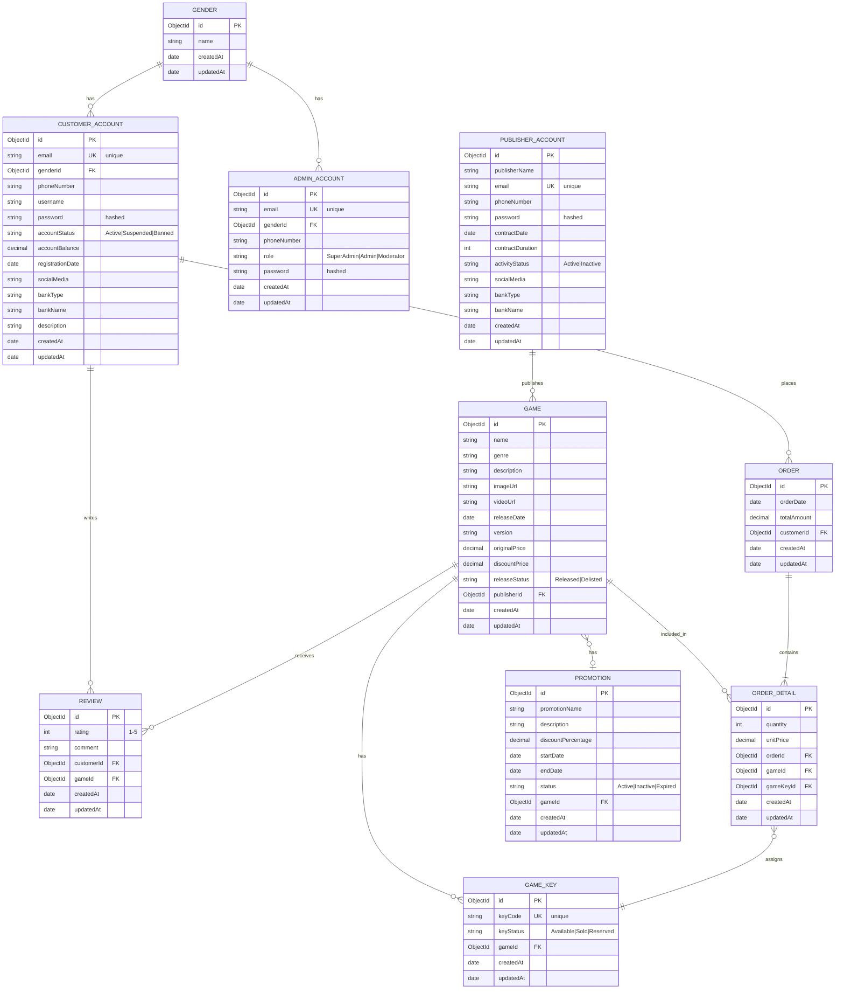

# Entity Relationship Diagram (ERD)

## Database Schema

## Relationships Explained

### One-to-Many Relationships

1. **GENDER → CUSTOMER_ACCOUNT**
   - One gender can be associated with many customers
   - Optional relationship (customer may not specify gender)

2. **GENDER → ADMIN_ACCOUNT**
   - One gender can be associated with many admins
   - Optional relationship

3. **CUSTOMER_ACCOUNT → ORDER**
   - One customer can place many orders
   - Required relationship (order must have a customer)

4. **CUSTOMER_ACCOUNT → REVIEW**
   - One customer can write many reviews
   - Required relationship (review must have a customer)

5. **PUBLISHER_ACCOUNT → GAME**
   - One publisher can publish many games
   - Required relationship (game must have a publisher)

6. **GAME → GAME_KEY**
   - One game can have many game keys
   - Required relationship (key must belong to a game)

7. **GAME → REVIEW**
   - One game can receive many reviews
   - Required relationship (review must be for a game)

8. **GAME → ORDER_DETAIL**
   - One game can appear in many order details
   - Required relationship

9. **ORDER → ORDER_DETAIL**
   - One order contains many order details
   - Required relationship (order detail must belong to an order)

### Many-to-One Relationships

10. **ORDER_DETAIL → GAME_KEY**
    - Many order details can reference one game key
    - Optional initially, assigned when order is processed

### Optional Relationships

11. **GAME ↔ PROMOTION**
    - One game can have one active promotion
    - Optional relationship (game may not have promotion)

## Indexes

### Unique Indexes
- `CUSTOMER_ACCOUNT.email`
- `PUBLISHER_ACCOUNT.email`
- `ADMIN_ACCOUNT.email`
- `GAME_KEY.keyCode`

### Regular Indexes (for query performance)
- `GAME.publisherId`
- `GAME.genre`
- `GAME.releaseStatus`
- `ORDER.customerId`
- `ORDER.orderDate`
- `ORDER_DETAIL.orderId`
- `ORDER_DETAIL.gameId`
- `REVIEW.gameId`
- `REVIEW.customerId`
- `GAME_KEY.gameId`
- `GAME_KEY.keyStatus`
- `PROMOTION.gameId`
- `PROMOTION.status`

## Data Constraints

### CUSTOMER_ACCOUNT
- `accountStatus`: ENUM('Active', 'Suspended', 'Banned')
- `accountBalance`: >= 0
- `email`: Valid email format, unique
- `password`: Minimum 8 characters, hashed with bcrypt

### PUBLISHER_ACCOUNT
- `activityStatus`: ENUM('Active', 'Inactive')
- `contractDuration`: > 0 (in months)
- `email`: Valid email format, unique
- `password`: Minimum 8 characters, hashed with bcrypt

### ADMIN_ACCOUNT
- `role`: ENUM('SuperAdmin', 'Admin', 'Moderator')
- `email`: Valid email format, unique
- `password`: Minimum 8 characters, hashed with bcrypt

### GAME
- `releaseStatus`: ENUM('Released', 'Delisted')
- `originalPrice`: >= 0
- `discountPrice`: >= 0, <= originalPrice
- `genre`: String (e.g., 'RPG', 'Action', 'Strategy', 'Adventure')

### GAME_KEY
- `keyStatus`: ENUM('Available', 'Sold', 'Reserved')
- `keyCode`: Unique, format: XXXX-XXXX-XXXX-XXXX

### REVIEW
- `rating`: Integer between 1 and 5
- `comment`: Optional text

### ORDER
- `totalAmount`: >= 0
- `orderDate`: Auto-generated on creation

### ORDER_DETAIL
- `quantity`: > 0
- `unitPrice`: >= 0

### PROMOTION
- `status`: ENUM('Active', 'Inactive', 'Expired')
- `discountPercentage`: 0-100
- `endDate`: >= startDate

## Business Rules

1. **Account Management**
   - Email must be unique across all account types (Customer, Publisher, Admin)
   - Passwords are hashed using bcrypt before storage
   - Customer accounts start with 0 balance and 'Active' status

2. **Game Management**
   - Games can only be created by Publishers or Admins
   - Publishers can only modify their own games
   - Admins can modify any game
   - Deleting a game sets status to 'Delisted' (soft delete)

3. **Order Processing**
   - Orders calculate totalAmount from order details
   - Game keys are assigned when order is created
   - Game key status changes from 'Available' to 'Sold'
   - Customers can only view their own orders

4. **Review System**
   - Customers can review games they've purchased
   - Rating must be between 1-5
   - Average rating is calculated dynamically

5. **Promotion System**
   - Only one active promotion per game
   - Expired promotions are marked automatically
   - Discount price is calculated from promotion percentage

6. **Authorization**
   - Customers: Manage own profile, place orders, write reviews
   - Publishers: Manage own games and game keys
   - Admins: Full access to all resources
   - SuperAdmins: Can create/delete other admins

## Collection Names in MongoDB

- `genders`
- `customer-accounts`
- `publisher-accounts`
- `admin-accounts`
- `games`
- `game-keys`
- `reviews`
- `orders`
- `order-details`
- `promotions`
