# Sequence Diagrams

## Authentication Flows

### 1. Customer Registration

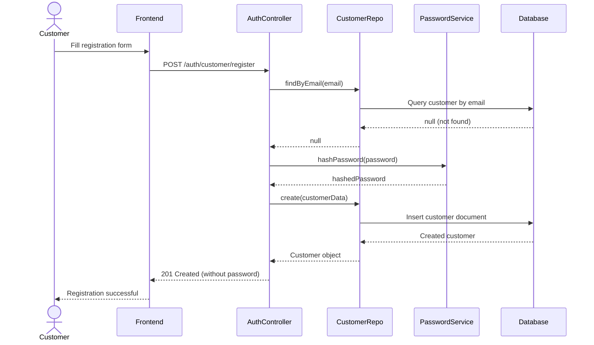

### 2. Customer Login

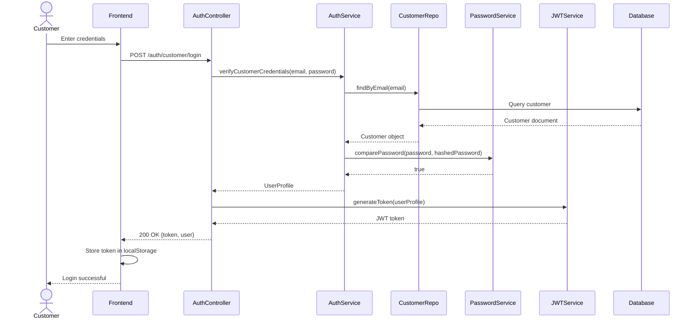

### 3. Admin Login

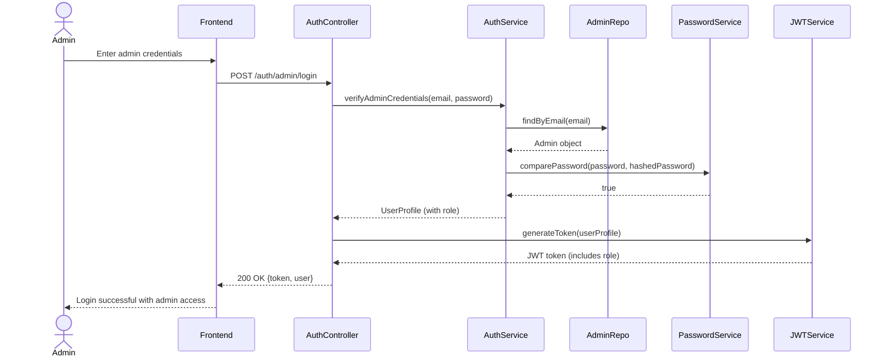

---

## Game Management Flows

### 4. Publisher Creates Game

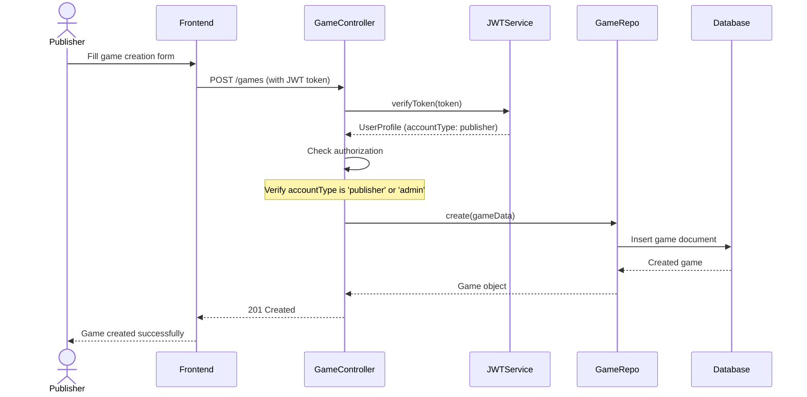

### 5. Customer Views Game Details

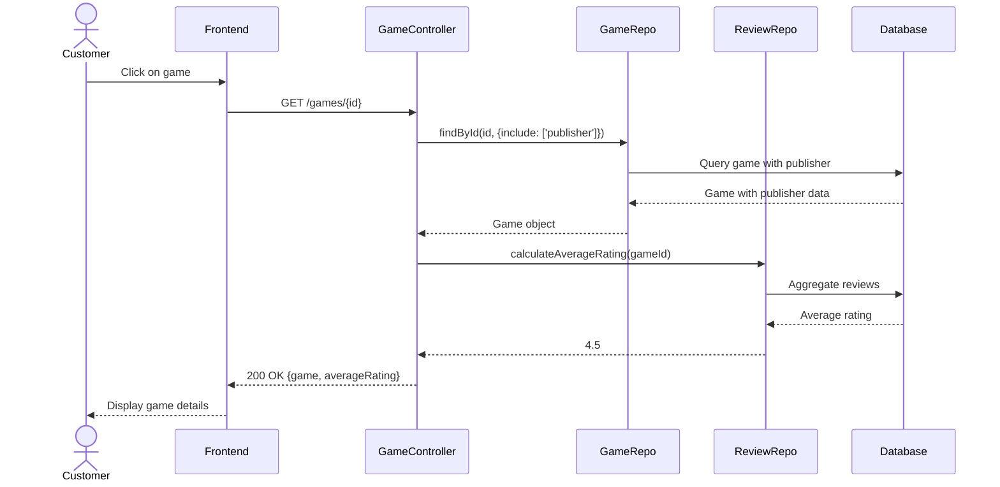

### 6. Admin Updates Any Game

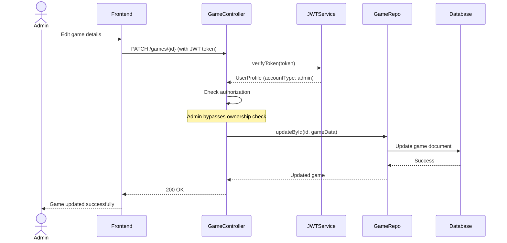

---

## Order Processing Flow

### 7. Customer Places Order

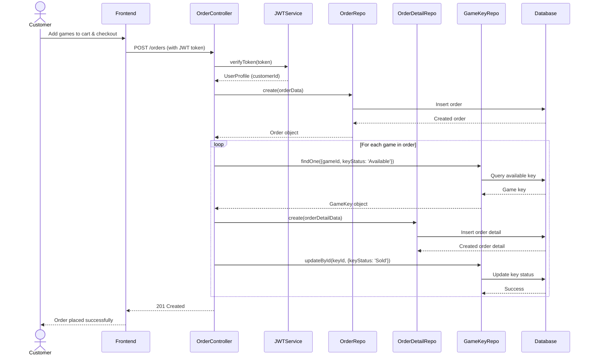

### 8. Customer Views Order History

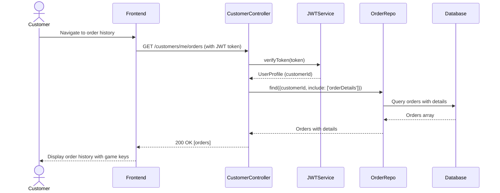

---

## Review System Flow

### 9. Customer Writes Review

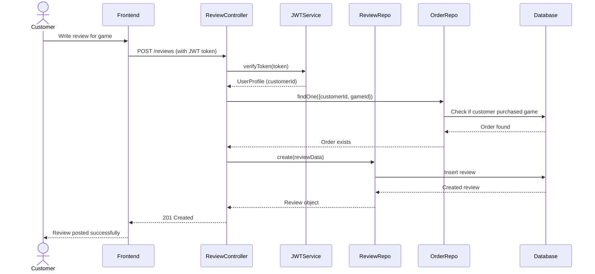

### 10. View Game Reviews

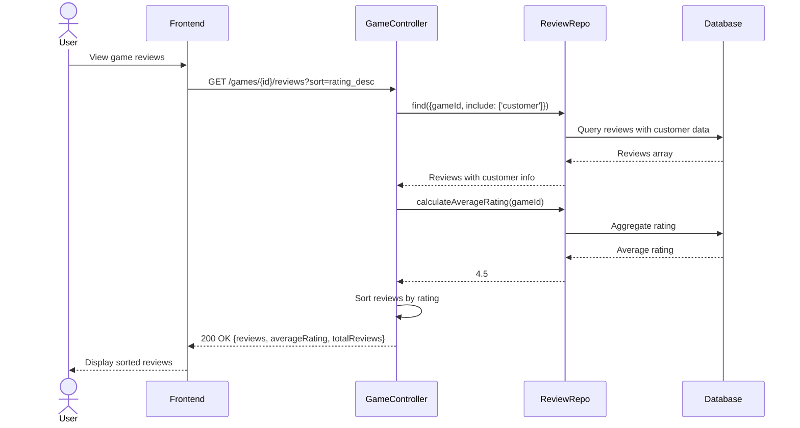

---

## Admin Management Flows

### 11. Admin Views Platform Statistics

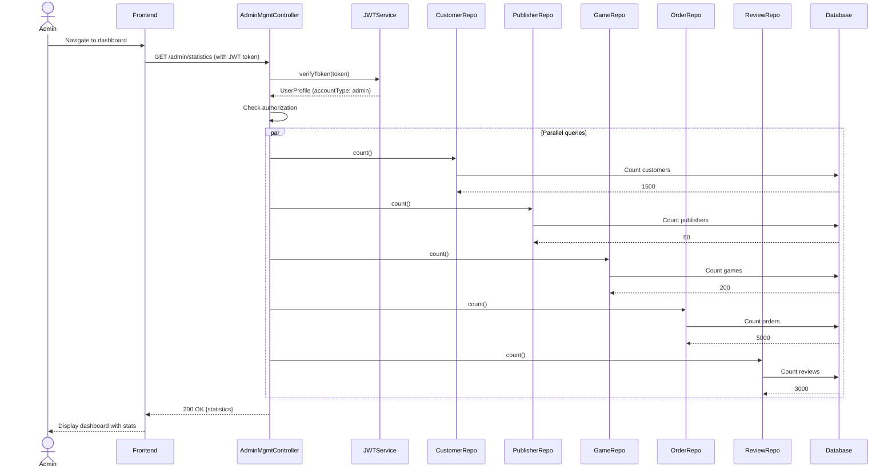

### 12. Admin Manages Customer Account

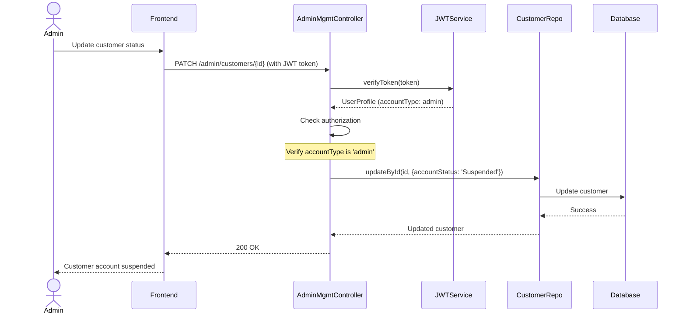

### 13. SuperAdmin Creates New Admin

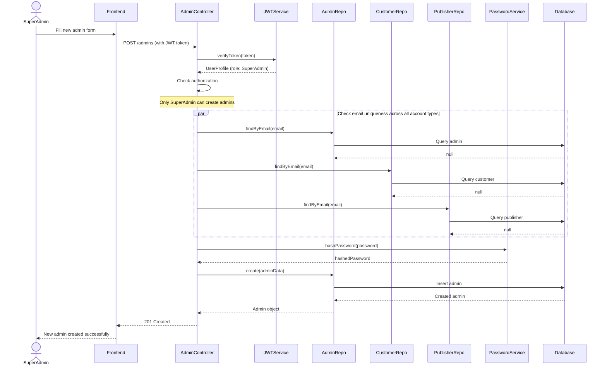

---

## Profile Management Flow

### 14. Customer Updates Profile

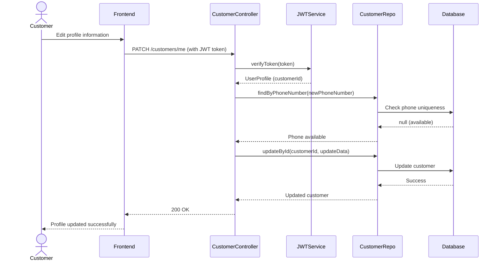

### 15. Change Password

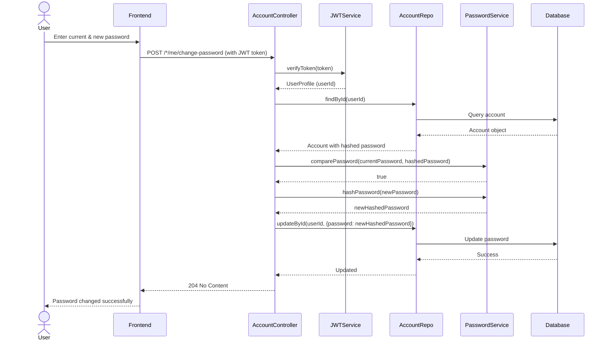

---

## Error Handling Flows

### 16. Authentication Failure

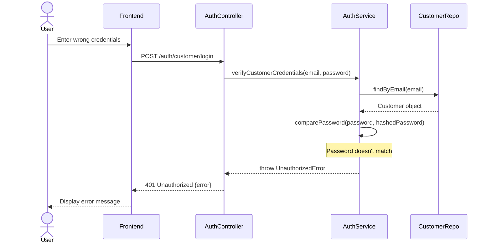

### 17. Authorization Failure

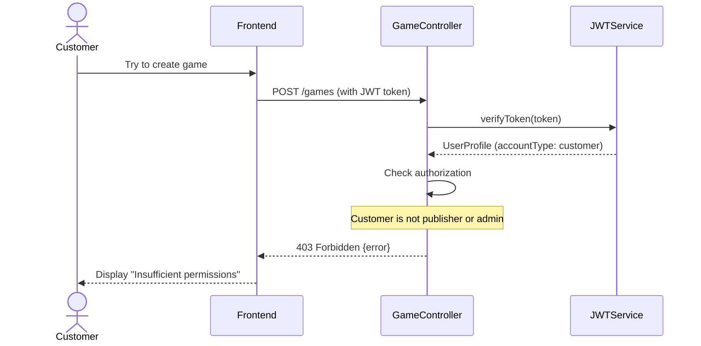

---

## Notes

- All authenticated requests include JWT token in Authorization header
- Tokens are verified and decoded to extract user information
- Authorization checks happen after authentication
- Admins have elevated privileges and can bypass ownership checks
- Database operations use MongoDB ObjectId for primary keys
- Passwords are always hashed before storage
- Soft deletes are used for games (status change to 'Delisted')
